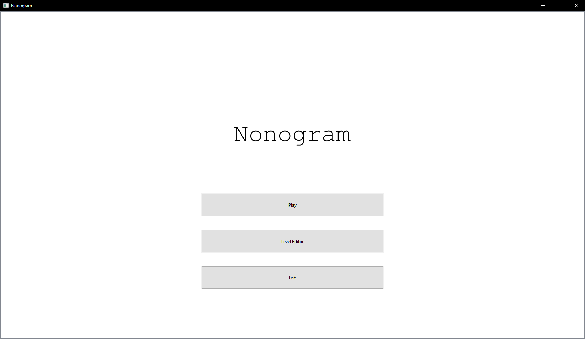

# Nonogram Game



## Introduction
Nonogram Puzzle Game is a logic-based number puzzle game. The objective is to fill in cells in a grid based on the provided hints for each row and column. The game also includes a level editor, allowing users to create their own puzzles.

## Features
- **Gameplay**: Solve Nonogram puzzles of various difficulties.
- **Level Editor**: Create and publish custom puzzles.
- **Profile Management**: Create and manage user profiles.
- **Highscores**: View and compare scores.
- **Persistence**: Load created puzzles from csv files.

## Getting Started
### Prerequisites
- Qt framework [>install here](https://www.qt.io/download-open-source)

### Building the project
1. Clone the Repository.
```bash
    git clone https://github.com/tanjinhung/Nonogram.git
```
2. Open the project in Qt Creator.
3. Build and Run the project.